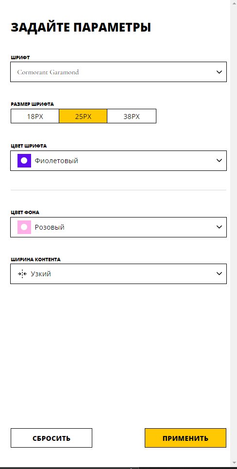

# Проектная работа: "Вёрстка проекта"

## Описание

Это проект представляет собой интерактивную платформу для редактирования статьи с возможностью изменения ее стилей и настроек. Пользователь может открывать боковую панель, настраивать свойства статьи, применять изменения или сбрасывать их до исходных значений. Платформа предназначена для демонстрации гибкости UI-компонентов, применения React — библиотеки и работы с CSS-переменными.


## Стек

- **HTML5**
- **SCSS**
- **JavaScript**
- **TypeScript**
- **Webpack**
- **Storybook**
- **ESLint/Prettier**

_в проекте использован React — библиотека для создания интерфейсов_

## Структура проекта

- `src/ `— исходные файлы проекта.
- `src/components/` — папка с JS компонентами.
- `src/constants/` — папка с константы проекта, данные о свойствах статей.
- `src/styles/` — общие стили проекта:
  1. `/index.scss` - главный файл стилей;
  2. `/index.module.scss` — стили с модульным подходом;
- `public/index.html` — HTML-файл главной страницы.
- `src/index.tsx` — папка с основным App кодом.
- `src/custom.d.ts` — файл для расширения возможностей TypeScript при импорте ресурсов, таких как файлы .svg, .png, .jpg, .json, .css, .scss.

## Инструкция по запуску

1. Скачайте или клонируйте репозиторий.
2. Выполните команды в терминале

```
npm install
npm run start
```

В проекте имеется сборка Webpack в нескольких вариантах:

- **build** - для сборки проекта
- **start** - для локальной разработки и просмотра
- **stylelint** - проверка SCSS-кода
- **lint** - проверка и исправление кода _(для проверки JavaScript, TypeScript, JSON и JSX файлов)_
- **format** - форматирование кода _(использует Prettier для форматирования, включая JavaScript, TypeScript, CSS и Markdown)_
- **build-storybook** - сборка Storybook
- **storybook** - запуск Storybook

### Конфигурация

В проекте используются четыре файла конфигурации Webpack:

- **webpack.common.js** - базовые настройки, точки входа (entry points), правила обработки файлов (loaders), плагины;
- **webpack.dev.js** - устанавливает режим `development`, настраивает локальный сервер, включает быстрые перезагрузки (HMR) и удобные отладочные карты (source maps);
- **webpack.prod.js** - устанавливает режим `production`, включает оптимизацию и отключает инструменты отладки, чтобы файлы были меньше;
- **webpack.config.js** - определяет, какой конфиг использовать через переменную окружения env, объединяет общие настройки и специфичные;

### Ссылка на репозиторий:

`https://github.com/PolliSun/blog-customizer.git`

## Реализованный функционал

- При нажатии на **стрелку** открывается сайдбар с настройками, при повторном нажатии или клике вне сайдбар закрывается;
- При изменении настроек в сайдбаре они не применяются сразу. После нажатия на **применить** стили применяются к статье;
- При нажатии **сбросить** настройки в форме сбрасываются на начальные, которые были при открытии страницы, и стили применяются к статье;
- Настройки устанавливаются через CSS-переменные, которые уже есть в стилях и установлены в коде в дефолтные значения;
- Предусмотрена корректная обработка и проверка введенных данных в форме;

## Что сделано

- Написан механизмы для управления состоянием формы и ее взаимодействия с родительской страницей.
- Разработана панель редактирования с возможностью открытия и закрытия, использованы компоненты UI-kit для соответствия макету.
- 
- Разделено сохранение состояния страницы и состояния формы, обеспечивая их независимость.
- Разработана логика применения нового состояния через CSS-переменные, обновляя стили в компоненте App после нажатия на **применить**.
  

## Благодарность

Выражаю благодарность **Яндекс Практикуму** за предоставление дизайна и теории.
